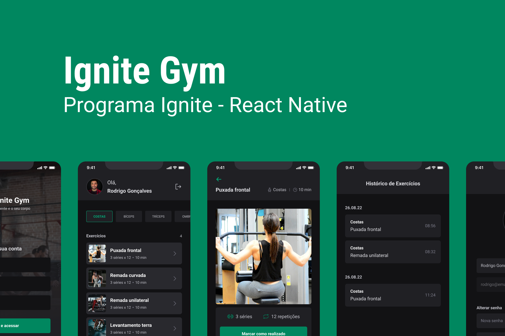

<p align="center">
  <h1 align="center">Ignite Gym - React Native :rocket:</h1>
</p>

<p align="center" margin-top="25px" >
  

  
</p>


Ignite Gym é uma aplicação de gerenciamento de treinos para academia.

___

## 💻 Sobre
O Ignite Gym é uma aplicação para você gerenciar seus treinos na academia e ter mais controle sobre os exercícios que está realizando. A Aplicação consome um back-end em Node.js que contém uma variedade de exercícios divididos em categorias, de modo que você pode filtrar pela categoria e então acessar o exercício desejado para receber a recomendação de quantas séries realizar. Após realizar um exercício você pode marcá-lo como realizado, e então ele ficará salvo em seu histórico.

A aplicação conta com um sistema de cadastro de usuários 100% funcional, fazendo uso de tokens de autenticação, onde você pode gerenciar a sua senha e o seu avatar.

Além disso, toda ela funciona com o uso do Async Storage, ou seja, se você fechar a aplicação os dados que inseriu nela estarão lá na próxima vez que você abri-la.

___

## 🎨 Layout
Imagens da aplicação são vistas abaixo:



___

## 🛠 Tecnologias

As seguintes tecnologias foram empregadas na criação deste projeto:

- [React Native](https://reactnative.dev/)
- [TypeScript](https://www.typescriptlang.org/)
- [Phosphor Icons](https://phosphoricons.com/)
- [ESLint](https://eslint.org/)
- [Gluestack](https://gluestack.io)
- [Async Storage](https://reactnative.dev/docs/asyncstorage)
- [React Navigation](https://reactnavigation.org/)
- [React Navigation Native Stack](https://reactnavigation.org/docs/native-stack-navigator/)
- [Expo Google Fonts](https://github.com/expo/google-fonts)
- [Axios](https://axios-http.com/ptbr/docs/intro)
- [React Navigation Bottom Tabs](https://reactnavigation.org/docs/bottom-tab-navigator/)
- [Expo Image Picker](https://docs.expo.dev/versions/latest/sdk/imagepicker/)
- [React Hook Form](https://www.react-hook-form.com/)
- [Yup](https://github.com/jquense/yup)

___

## 🚀 Como utilizar

Clone o projeto para o local desejado em seu computador.

```bash
$ git clone git@github.com:luanyata/Ignite-Gym.git
```
___

#### 🚧 Executando o Back-end
```bash

# Navegue até o diretório
$ cd api

# Instale as dependências necessárias
$ npm install

# Agora inicie o servidor do back-end
$ npm run start

# O servidor irá rodar na porta 3333 com o aviso: "Server is running on Port 3333".

```
___

#### 🚧 Executando o Front-end
```bash

# Com o back-end rodando, abra um novo terminal e navegue até o diretório
$ cd mobile

# Instale as dependências necessárias
$ npm install

# Agora inicie a aplicação - Um QR Code será exibido no Terminal
$ npm run start

# Eu seu celular instale o aplicativo Expo Go - Ele é gratuito na PlayStore.

# Abra o Expo Go que acabou de instalar, e então escaneie o QR Code através do aplicativo.

# A aplicação então será exibida de forma 100% funcional diretamente em seu celular.

```

